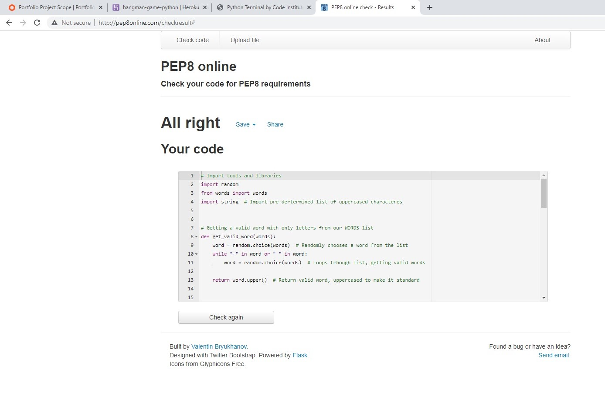

# Welcome to **HANGMAN**

Hangman is a Python terminal game, which runs in the Code Institute mock terminal on Heroku.

Hangman is a quick and easy game for at least two people or in this case "people vs machine". The computer, makes up a secret word, while the player tries to guess the word by guessing what letters it contains. However, every wrong guess brings them one step closer to losing, if you miss your life is decreased by one. So welcome player to this website, where you  can play online against the computer, for as long as you wish. Enjoy the Game.

<https://hangman-game-python.herokuapp.com/>

## How to play

Hangman is an old school favorite, a word game where the goal is simply to find the missing word or words.

You will be presented with a number of blank spaces representing the missing letters you need to find.

Use the keyboard to guess a letter (I recommend starting with vowels).

If your chosen letter exists in the answer, then all places in the answer where that letter appear will be revealed.

After you've revealed several letters, you may be able to guess what the answer is and fill in the remaining letters.

Be warned, every time you guess a letter wrong you loose a life.

Solve the puzzle before the hangman dies.

## Features

### Existing Features

- __Random_word_generation__

  - Words are randomly picked from a set list of words offering a total unpredictable experience for the User.

- __The Match Area__

  - Plays against the computer.
  - Takes user input.
  - Decreases life on missed guesses.
  - Displays blank spaces to be fullfiled with letters.

- __Input_validation_and_error_checking__

  - Checks for input and gives a message if letter was already guessed, if not a valid character and if guess is right or wrong.
  - Displays a set list with already used letters to avoid repetition.
  - Displays the right guessed letters.

### Features Left to Implement

- I would like to have included some sort of animation where you can actually see the hangman being built.

## Testing

Manually tested this project by doing the following:

- Passed the code through PEP8 online validator.
- Tested with differnt inputs to check the response message efectivenes.
- Tested in Code institute Heroku terminal.

### Validator Testing

- Python
  - No errors were returned when passing through the official [PEP8 validator](https://hangman-game-python.herokuapp.com/)

### Unfixed Bugs

No bugs remaining

## Deployment

This project was deployed using Code Institute`s mock terminal for Heroku:

- Steps for deployment:
  - Fork or clone this repository.
  - Create new Heroku app.
  - Set the build packs to Python and NodeJS in that order.
  - Link the Heroku app to the repository.
  - Click on Deploy.

The live link can be found here - <https://hangman-game-python.herokuapp.com/>

## Credits

- To create this program, I relied heavily on the material covered in the Full Stack Development course by Code Institute. I also used Online Web Tutorials. I learnt the course material but did have to refer to additional YouTube videos to get a better understanding.
- Code Institute for the deployment terminal.
- Wikipedia for details of the hangman game.
